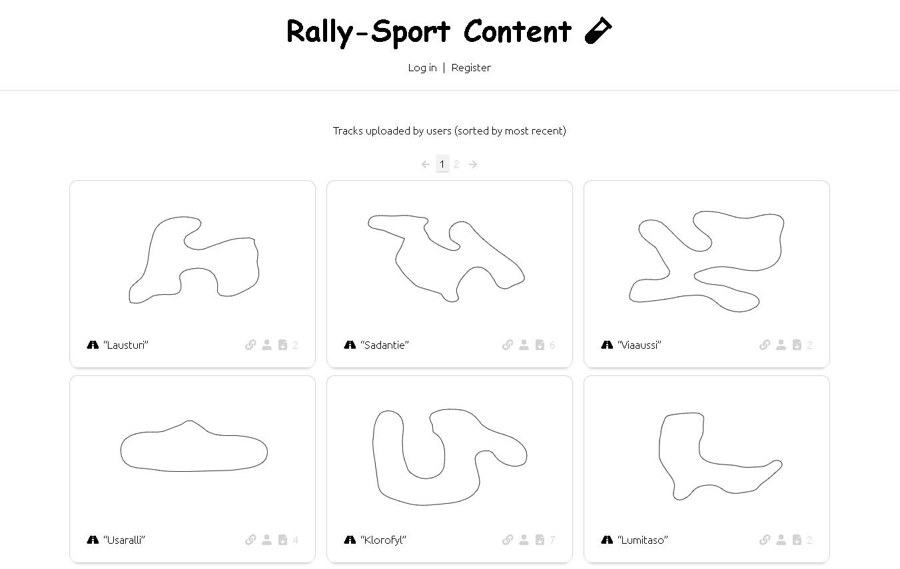

# Rally-Sport Content

A backend app with a frontend view to host and deliver user-made content for Rally-Sport/[RallySportED](https://www.github.com/leikareipa/rallysported/).

The app can be found live on the web [here](https://www.tarpeeksihyvaesoft.com/rallysport-content/).



# What's this about?

Rally-Sport Content provides modders of Rally-Sport (the mid-90s racing game) a centralized service to share with others the content they've made.

Rally-Sport Content is aimed at content made using the [RallySportED](https://www.github.com/leikareipa/rallysported/) toolset; and integrates with browser-based implementations of those tools. For example, you can directly open tracks hosted on Rally-Sport Content in the [browser-based RallySportED track editor](https://www.tarpeeksihyvaesoft.com/rallysported/?track=demod).

# Communicating with the API

Rally-Sport Content provides the end-user a REST API to access hosted content.

The API supports the following requests: GET, POST, and DELETE; although some content only supports a subset of these.

## GET

Information (including raw data) about resources can be queried via GET requests.

| URL                                                     | Output                                       |
| ------------------------------------------------------- | -------------------------------------------- |
| /rallysport-content/[resource]/                         | Resource listing as a HTML page.             |
| /rallysport-content/[resource]/?metadata=1              | Resource metadata in JSON format.            |
| /rallysport-content/[resource]/?json=1&id=[resource-id] | The given resource's data in JSON format.*   |
| /rallysport-content/[resource]/?zip=1&id=[resource-id]  | The given resource's data in a ZIP archive.* |

*Supported for `track` resources only.

### Examples

Request: `GET /rallysport-content/tracks/`

Response:
```html
<!doctype html>
<html>
    ...
</html>
```

Request: `GET /rallysport-content/tracks/?metadata=1`

Response:
```json
[
    {
        "name": "TrackA",
        "id": "track.xxx-xxx-xxx",
        "creatorID": "user.xxx-xxx-xxx",
        "width": 64,
        "height": 64
    },
    {
        "name": "TrackB",
        "id": "track.xxx-xxx-xxx",
        "creatorID": "user.xxx-xxx-xxx",
        "width": 128,
        "height": 128
    }
]
```

Request: `GET /rallysport-content/tracks/?json=1&id=track.xxx-xxx-xxx`

Response:
```json
[
    {
        "container": "...",
        "manifesto": "...",
        "meta":
        {
            "internalName": "TrackA",
            "displayName": "TrackA",
            "width": 64,
            "height": 64,
            "id": "track.xxx-xxx-xxx",
            "creatorID": "user.xxx-xxx-xxx"
        }
    }
]
```

Request: `GET /rallysport-content/tracks/?zip=1&id=track.xxx-xxx-xxx`

Response:
```json
"PK..."
```

## POST

New resources can be added via POST requests.

| URL                              | Body                 |
| -------------------------------- | -------------------- |
| /rallysport-content/[resource]/  | multipart/form-data* |

*Must also include a PHPSESSID cookie that identifies the requester as a logged-in user.

Instead of directly issuing POST requests, please use the HTML form provided for the particular resource at `/rallysport-content/[resource]/?form=add`.

## DELETE

Existing resources can be removed via DELETE requests.

| URL                                              | Body    |
| ------------------------------------------------ | ------- |
| /rallysport-content/[resource]/?id=[resource-id] | (none)* |

*Supported for `track` resources only. Must also include a PHPSESSID cookie that identifies the requester as a logged-in user.

Instead of directly issuing DELETE requests, please use the HTML form provided for the particular resource at `/rallysport-content/[resource]/?form=delete`.

# Hosting the service

To host Rally-Sport Content on your own PHP 7.1-compatible, MySQL-enabled server, do the following:

- Copy the [rallysport-content](rallysport-content/) directory onto your server
    - The server's client-facing directory structure should be `<host>/rallysport-content/` - e.g. [tarpeeksihyvaesoft.com/rallysport-content/](https://www.tarpeeksihyvaesoft.com/rallysport-content/) - as some of Rally-Sport Content's code makes a hard-coded assumption of such.
- Set up your database tables as per the [Database](#database) subsection
- Optionally, ensure that PHP's [mail()](https://www.php.net/manual/en/function.mail.php) function is able to send email from your server
- Optionally, also host the [browser-based RallySportED editor](https://www.github.com/leikareipa/rallysported-js/)
    - At `<host>/rallysported/` - e.g. [tarpeeksihyvaesoft.com/rallysported/](https://www.tarpeeksihyvaesoft.com/rallysported/)

## Database

Rally-Sport Content uses one database table for each resource type.

### Users

```sql
CREATE TABLE rsc_users (
    id INT UNSIGNED AUTO_INCREMENT PRIMARY KEY,
    resource_id VARCHAR(64) UNIQUE NOT NULL,
    resource_visibility TINYINT UNSIGNED NOT NULL,
    resource_data_hash_sha256 VARCHAR(64) UNIQUE NOT NULL,
    creation_timestamp BIGINT NOT NULL,
    password_hash_php VARCHAR(255) UNIQUE NOT NULL,
    email_hash_sha256 VARCHAR(64) UNIQUE NOT NULL,
    password_reset_token VARCHAR(64) DEFAULT NULL,
    password_reset_token_expires BIGINT DEFAULT NULL,
    php_session_id VARCHAR(64) DEFAULT NULL
) CHARACTER SET latin1;
```

#### Description of columns

| Column | Description |
| ------ | ----------- |
| password_hash_php | A one-way salted hash of the user's password, obtained from PHP's [password_hash](https://www.php.net/manual/en/function.password-hash.php) function. |
| email_hash_sha256 | A one-way peppered SHA256 hash of the user's email address. |
| password_reset_token | A random string of characters, (re-)generated when the user requests a password reset. Used as a one-time authorization token when resetting the password. |
| password_reset_token_expires | A Unix epoch timestamp marking the time after which  password_reset_token becomes invalid. |
| php_session_id | The PHPSESSID string of the most recent session that logged into this user's account. Will be reset to NULL when the user logs out, and used to enforce a limit of one active session per account. |
| [Continues here](#common-columns) | |

### Tracks

```sql
CREATE TABLE rsc_tracks (
    id INT UNSIGNED AUTO_INCREMENT PRIMARY KEY,
    resource_id VARCHAR(64) UNIQUE NOT NULL,
    resource_visibility TINYINT UNSIGNED NOT NULL,
    resource_data_hash_sha256 VARCHAR(64) UNIQUE,
    creator_resource_id VARCHAR(64) NOT NULL,
    creation_timestamp BIGINT NOT NULL,
    download_count INT UNSIGNED DEFAULT 0,
    track_name VARCHAR(8) UNIQUE,
    track_width SMALLINT UNSIGNED,
    track_height SMALLINT UNSIGNED,
    track_container_gzip MEDIUMBLOB,
    track_manifesto_gzip BLOB,
    kierros_svg_gzip BLOB
) CHARACTER SET latin1;
```

#### Description of columns

| Column | Description |
| ------ | ----------- |
| download_count | A value expressing how many times this track's data has been requested from the database. Only counts requests for data, not metadata. |
| track_container_gzip | A GZIPped string of the data of the track's container file. |
| track_manifesto_gzip | A GZIPped string of the track's manifesto file. |
| kierros_svg_gzip | A GZIPped string representing an SVG image of the track's KIERROS data (the CPU driver's path around the track). |
| [Continues here](#common-columns) | |

### Common columns

The following columns are common to all resource tables.

| Column | Description |
| ------ | ----------- |
| resource_id | A string corresponding to the resource type's `ResourceID` (cf. [resource-id.php](rallysport-content/api/common-scripts/resource/resource-id.php)). |
| creator_resource_id | A string corresponding to the `UserResourceID` (cf. [resource-id.php](rallysport-content/api/common-scripts/resource/resource-id.php)) of the user who uploaded this resource. |
| resource_visibility | A value corresponding to `ResourceVisibility` (cf. [resource-visibility.php](rallysport-content/api/common-scripts/resource/resource-visibility.php)). |
| resource_data_hash_sha256 | A SHA256 hash of the resource's pertinent data. Used e.g. to detect duplicates of the resource. |
| creation_timestamp | A Unix epoch timestamp of when this resource was added to the database. |

## Administrating

### Reviewing uploaded content

When a user uploads a resource (e.g. a track), its visibility (cf. [resource-visibility.php](rallysport-content/api/common-scripts/resource/resource-visibility.php)) will be set to non-public by default, and must be made public manually by the administrator before the resource's data can be accessed by users.

To do this, simply update the `resource_visibility` column for the given resource to the value of `ResourceVisibility::PUBLIC`. (Presumably, you'll first want to inspect the resource to make sure it doesn't break any of your content rules, etc.)

### Backing up content

All user-submitted content is stored in the database, so backing up the database is sufficient to back up content data.

# Navigating the codebase

API entry points can be found in the various index.php files - e.g. [tracks/index.php](rallysport-content/tracks/index.php) handles requests arriving to `/rallysport-content/tracks/`.

The entry points direct incoming requests to relevant functions in the codebase.

Requests will always be responded to via a `Response` object (cf. [api/response.php](rallysport-content/api/response.php)). For example, `exit(Response::code(404)->error_message("Oops"))` will respond to the client with code 404 and the error message "Oops".

# License

Rally-Sport Content  is licensed under GPL2-or-later, with the exception of [api/common-scripts/zip-file.php](rallysport-content/api/common-scripts/zip-file.php) (see that file for details).

Distributions of Rally-Sport Content that include the aforementioned [zip-file.php](rallysport-content/api/common-scripts/zip-file.php) should be made under GPL2-only.

# Authors and credits

Rally-Sport Content is developed by [Tarpeeksi Hyvae Soft](https://www.tarpeeksihyvaesoft.com).

The HTML view in Rally-Sport Content makes use of icons provided by [Font Awesome](https://www.fontawesome.com/).